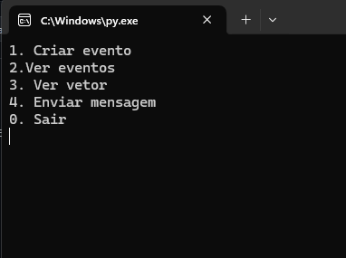

<h1 align="center">  Relógio vetorial - Sistema distribuído. </h1>


<p align="center">Trabalho solicitado pelo professor Tércio de Morais, da disciplina de Sistemas Distribuídos..</p>
<p align="center">Implementação de relógios vetoriais para fins de avaliação na disciplina de Sistemas Distribuídos</p>

<p align="center"> 
  <a href="https://angular.io/">
        ,
  </a>
</p>


<h4 align="center"> 
	🚧  Trabalho finalizado  🚧
</h4>


### Especificações da atividade
- Trabalho em dupla (no máximo)
- Pontuação: 2,5
- Implementar a lógica de relógios vetoriais em uma linguagem de programação adequada para sistemas distribuídos.
- Realizar testes extensivos para validar a corretude e a eficiência da implementação através de uma simulação.
 #
### Features

- [x] Troca de mensagens entre vários processos aleatoriamente.
- [x] Definir portas dinamicamente para cada processo.
- [x] Registro dos processos e portas.
- [x] Todos os processos conhecem uns aos outros e consequentemente suas portas.
- [x] Implementação do algoritmo de Relógios Vetoriais - Mattern,Figdge,1988
- [x] Criar evento no processo.
- [x] Ver lista de eventos do processo.
- [x] Criação de processo cliente/servidor em socket
- [x] Utilização de threading para uso simultâneo de recursos.
- [x] Navegação em menus dos recursos.
- [ ] Envio de mensagens automáticas em intervalos de tempo.
 #

### Demonstração
<h1 align="center">
  
</h1>

### Pré-requisitos

     pip install psutil


 #
 
### Funcionamento

1. **Executando o Código**:
   - Abra um terminal ou prompt de comando na pasta onde salvou o arquivo Python.
   - Execute o código Python digitando:
     
     ```
     python nomedoarquivo.py
     ```
   - Isso iniciará o processo e exibirá o menu principal no terminal.
   - Repita esse etapa até atingir o número desejado de processos.
   - Ao iniciar o programa, o processo será registrado no arquivo `processos.json`.

2. **Interagindo com o Menu Principal**:
   - No menu principal, você terá as seguintes opções:
     - **1. Criar evento**: Cria um evento e o adiciona à lista de eventos.
     - **2. Ver eventos**: Exibe a lista de eventos previamente criados.
     - **3. Ver vetor**: Exibe o vetor de relógio lógico atual.
     - **4. Enviar mensagem**: Envia uma mensagem para um processo aleatório disponível.
     - **0. Sair**: Finaliza o processo e fecha o programa.

3. **Observações**:
   - Certifique-se de permitir a execução do código em qualquer firewall ou software de segurança instalado, pois ele usa comunicação de rede.
   - Os eventos criados serão exibidos na lista de eventos.
   - O vetor de relógio lógico será atualizado conforme as interações do usuário.
   - Ao sair do programa, o processo será removido do registro de processo do arquivo `processos.json`.
   - É importante fechar o programa pelo menu na `opção - 0`, fechar o programa de outra forma vai quebrar o fluxo.
   - É importante caso aconteça algum problema, que o arquivo `processos.json` tenha como texto um json vazio `{}`.

#
 
### Autores
#### Luckas Ferreira
<a href="https://instagram.com/luckas_.ferreira" target="_blank"></a><a href = "mailto:lucas.ferreira2@arapiraca.ufal.br"></a><a href="https://www.linkedin.com/in/luckas-ferreira-49a7a219b/" target="_blank"></a>  
  

#### Roberto
<a href="https://instagram.com/jrobertogram" target="_blank"></a><a href = "mailto:jose.silva9@arapiraca.ufal.br"></a><a href="https://www.linkedin.com/in/robertogram/" target="_blank"></a> 

